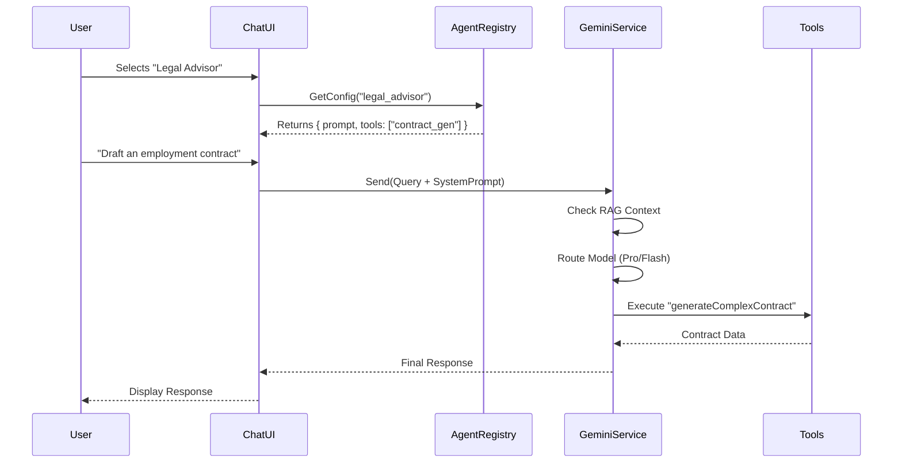

# DerivHR Agent Logic Workflows & Architecture

## Current Architecture (Hybrid AI System)

The system currently uses a hybrid approach to routing AI queries, balancing between local processing (simulated or smaller models) and cloud-based inference (Google Gemini Pro).

### 1. Request Flow
1.  **User Input**: User sends a message via `ChatAssistant.tsx`.
2.  **Model Routing** (`services/geminiService.ts` -> `determineModelRouting`):
    *   **Simple Queries**: Keywords like "hello", "help", "time" are routed to the `local` model.
    *   **Complex Queries**: Keywords like "analyze", "contract", "legal", "strategy" are routed to `gemini-pro`.
3.  **Context Retrieval (RAG)**:
    *   The system retrieves context from `knowledgeBaseMemory` (a simple in-memory string array).
    *   Relevant context is appended to the prompt.
4.  **Processing**:
    *   **Gemini Pro**: Uses the Google GenAI SDK to generate a response.
    *   **Local**: Returns a predefined or logically computed response (currently simulated).
5.  **Tool Execution**:
    *   The system identifies if specific tools (Payroll, Telegram, WhatsApp) are needed based on the response content or intent.

### 2. Agent Personas (Currently in `ChatAssistant.tsx`)
The application supports multiple personas, currently defined within the UI component state:
*   **HR Assistant**: General HR queries, leave management.
*   **Legal Advisor**: Contract generation, compliance checking.
*   **Data Analyst**: Workforce analytics, report generation.

### 3. Tool Integration
*   **Payroll**: `utils/payroll.ts` (Malaysian labor law calculations).
*   **Messaging**: `services/messagingService.ts` (Telegram/WhatsApp).
*   **Document Generation**: `services/geminiService.ts` (Contract generation).

---

## Proposed Refactored Workflow (Centralized Agent Registry)

To improve maintainability and scalability, we are moving to a configuration-driven "Agent Registry".

### New Architecture: `services/agentRegistry.ts`

#### Workflow
1.  **Agent Selection**: User selects an agent (persona) in the UI.
2.  **Registry Lookup**: The system loads the specific system prompt, allowed tools, and temperature settings from `agentRegistry.ts`.
3.  **Unified Processing**:
    *   The `ChatAssistant` sends the query + agent configuration to `geminiService`.
    *   `geminiService` handles the API call using the specific system instruction for that agent.

#### Agent Definitions
Each agent will be defined by:
*   `id`: Unique identifier (e.g., 'hr_generalist').
*   `name`: Display name.
*   `systemPrompt`: Core instructions defining personality and capabilities.
*   `tools`: List of accessible tools (e.g., `['payroll_calc', 'kb_search']`).
*   `model`: Preferred model (e.g., 'gemini-1.5-flash', 'gemini-1.5-pro').

### Visualization

