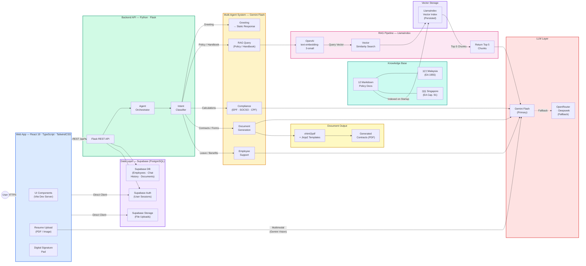

# DerivHR - High Level Architecture

## Tech Stack At-a-Glance

| Layer | Technology | Purpose |
|-------|-----------|---------|
| **Frontend** | React 19, TypeScript, Vite, TailwindCSS | Web portal (HR Admin + Employee) |
| **Backend** | Python, Flask | REST API, orchestration |
| **AI Framework** | LlamaIndex | RAG pipeline, vector indexing |
| **Primary LLM** | Google Gemini Flash | Intent classification, generation, vision |
| **Embeddings** | OpenAI text-embedding-3-small | Document vectorization |
| **Fallback LLM** | OpenRouter (Deepseek) | Resilient multi-tier fallback |
| **Database** | Supabase (PostgreSQL) | Employees, chat history, documents, auth, file storage |
| **Doc Generation** | xhtml2pdf + Jinja2 | Contract PDF rendering |

## Estimated AI Costs (~1,000 queries/day)

| Service | Monthly Cost |
|---------|-------------|
| Gemini Flash | ~$5–15 |
| OpenAI Embeddings | ~$2–5 |
| Supabase | Free tier |
| **Total** | **~$20–30/month** |
